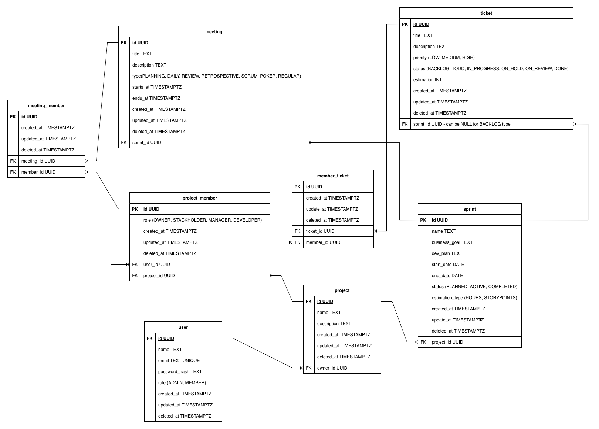

# Scrumio

**Scrumio** is a backend REST API for managing Scrum-based projects. It covers the full lifecycle of projects, sprints, tickets, meetings, and team members.

---

## Tech Stack

- **Java 25** / **Spring Boot 4.0.2**
- **PostgreSQL** — primary database
- **Flyway** — schema migrations
- **Spring Data JPA** — data access layer

---

## Core Features

- Project and team member management (role-based: OWNER, MANAGER, DEVELOPER, STAKEHOLDER)
- Sprint planning and lifecycle (PLANNED → ACTIVE → COMPLETED)
- Ticket management with status tracking and member assignments
- Meeting scheduling with member participation
- Soft delete on all entities (`deleted_at`)
- Cookie-based authentication via external auth service
- Structured error handling with typed exceptions

---

## Domain Model

| Entity | Description |
|---|---|
| User | System user with role (ADMIN, MEMBER) |
| Project | Top-level container for sprints, tickets, meetings |
| ProjectMember | User ↔ Project join with role |
| Sprint | Time-boxed iteration; estimation via STORY_POINTS or HOURS |
| Ticket | Work item with status, priority, and sprint assignment |
| MemberTicket | Ticket ↔ ProjectMember assignment junction |
| Meeting | Scheduled team event with type and time range |
| MeetingMember | Meeting ↔ ProjectMember participation junction |

**Enums:**
- `TicketStatus`: BACKLOG, TODO, IN_PROGRESS, ON_HOLD, ON_REVIEW, DONE
- `TicketPriority`: LOW, MEDIUM, HIGH
- `SprintStatus`: PLANNED, ACTIVE, COMPLETED
- `SprintEstimationType`: STORY_POINTS, HOURS
- `MeetingType`: PLANNING, DAILY, REVIEW, RETROSPECTIVE, SCRUM_POKER, REGULAR
- `ProjectMemberRole`: OWNER, STAKEHOLDER, MANAGER, DEVELOPER
- `UserRole`: ADMIN, MEMBER

---

## Architecture

Layered architecture:

```
Controller → Service → Repository → Entity
```

Package root: `com.example.scrumio`

```
auth/           @RequireAuth annotation, AuthInterceptor, AuthClient, AuthContext
config/         Web MVC configuration
controller/     REST endpoints
service/        Business logic
repository/     Spring Data JPA (JOIN FETCH to prevent N+1)
entity/         JPA entities + enums (subdomain subpackages)
web/dto/        Java record request/response types
web/exception/  GlobalExceptionHandler + typed exceptions
mapper/         Entity ↔ DTO mappers
```

---

## API Overview

| Resource | Base Path |
|---|---|
| Users | `/api/v1/users` |
| Projects | `/api/v1/projects` |
| Sprints | `/api/v1/sprints` |
| Tickets | `/api/v1/tickets` |
| Meetings | `/api/v1/meetings` |
| Project Members | `/api/v1/projects/{projectId}/members` |
| Ticket Assignments | `/api/v1/tickets/{ticketId}/members` |

All endpoints require authentication (via cookie) except `POST /api/v1/users`.

---

## Database

Migrations in `src/main/resources/db/migrations/`:

- `V1__create_baseline.sql` — PostgreSQL ENUM types + 8 core tables
- `V2__create_indexes.sql` — Indexes on FK columns

All tables have `created_at`, `updated_at`, `deleted_at` columns.

Local setup: `localhost:5432`, database `scrumio_db`, user/password `admin/admin`.

---

## Running Locally

```bash
make up                # start suite containers
make run               # start the application
```

```bash
./gradlew build        # build
./gradlew test         # run tests
make postgres-down     # stop PostgreSQL container
```

Auth service URL must be set via `AUTH_SERVICE_URL` environment variable.

---

## DB Schema


